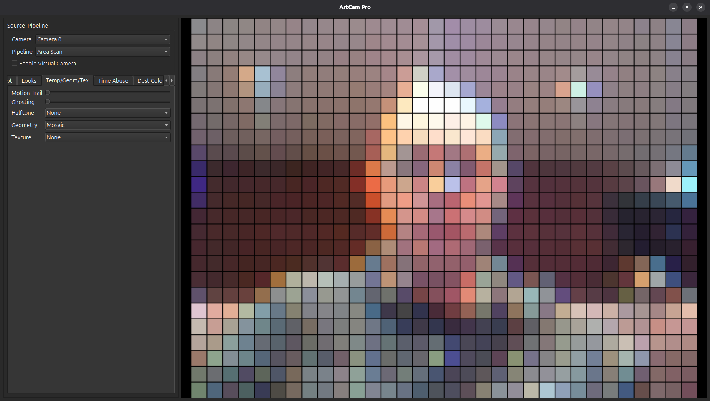

# ArtCam Pro



A real-time camera effects application with extensive filter options for creative video processing.

## Features

ArtCam Pro provides a wide range of visual effects organized into categories:

- **Basic Filters**: Invert, contrast, saturation, color depth adjustments
- **Edge & Sketch**: Canny, Sobel, Neon, Comic Ink edge detection and sketching
- **Glitch & Optical**: RGB split, jitter, block shifts, kaleidoscope, swirl effects
- **Looks & Light**: Sepia, Cyberpunk, Duotone presets, vignette, bloom
- **Temporal Effects**: Motion trails, ghosting, time smear, temporal echo
- **Geometry & Texture**: Mosaic, ASCII art, halftone dots, oil painting, watercolor
- **Time Abuse**: Freeze cells, memory burn, time jitter, slit-scan
- **Destructive Color**: Color collapse, hue shatter, bit rot, palette decay
- **Digital Violence**: Compression artifacts, row desync, packet loss
- **Spatial Chaos**: Pixel gravity, reality tear, voronoi destruction
- **Perception Weirdness**: Motion hallucination, impossible colors, edge overload
- **Hybrids**: Time-delayed mirrors, motion fossils, chrono-pixel sorting
- **Minimalism**: Single pixel, average reality, camera amnesia
- **Performance Art**: Surveillance degradation, digital death, resurrection loop
- **GPU Accelerated**: OpenCL-accelerated filters for better performance

## Pipeline Modes

Choose from various camera pipeline transformations:
- Area Scan
- Vertical/Horizontal Split
- Quad Mirror
- Radial Mirror
- Recursive Grid
- Time-Shifted Split
- RGB Channel Split
- Infinite Tunnel
- Checkerboard Mirror
- Kaleidoscope 8-way
- Scanline Interlace
- Glitch Grid
- Vertical/Horizontal Slit Scan

## Virtual Camera Support

Enable virtual camera output to use processed video in other applications (requires pyvirtualcam).

## Requirements

- Python 3.7+
- OpenCV
- NumPy
- PyQt6
- pyvirtualcam (optional, for virtual camera)

## Installation

1. Clone the repository:
```bash
git clone https://github.com/yourusername/artcam-pro.git
cd artcam-pro
```

2. Run the startup script (recommended):
```bash
./start.sh
```

This will:
- Create a virtual environment
- Install all dependencies
- Launch the application

### Manual Installation

If you prefer manual setup:

```bash
python3 -m venv venv
source venv/bin/activate  # On Windows: venv\Scripts\activate
pip install -r requirements.txt
python main.py
```

## Usage

Run the application:
```bash
python main.py
```

Or use the startup script:
```bash
./start.sh
```

- Select a camera from the dropdown
- Choose a pipeline mode
- Adjust filters using the tabbed interface
- Enable virtual camera if desired

## Project Structure

```
ArtCam/
├── main.py                 # Entry point
├── camera_manager.py       # Camera and virtual camera management
├── requirements.txt        # Python dependencies
├── filters/                # Image processing modules
│   ├── __init__.py
│   ├── image_processor.py  # Main processor class
│   ├── pipeline_filters.py # Pipeline transformations
│   ├── basic_filters.py    # Basic adjustments
│   ├── glitch_filters.py   # Glitch effects
│   ├── temporal_filters.py # Time-based effects
│   ├── destructive_filters.py # Color destruction
│   ├── spatial_filters.py  # Spatial distortions
│   ├── perception_filters.py # Perception effects
│   ├── hybrid_filters.py   # Mixed effects
│   ├── minimalism_filters.py # Minimalist effects
│   ├── performance_filters.py # Performance art
│   └── gpu_filters.py      # GPU-accelerated filters
├── gui/                    # User interface
│   ├── __init__.py
│   ├── main_window.py      # Main application window
│   └── tabs/               # UI tabs
│       ├── basic_tab.py
│       ├── edge_tab.py
│       ├── glitch_tab.py
│       ├── looks_tab.py
│       ├── temporal_tab.py
│       ├── time_abuse_tab.py
│       ├── destructive_tab.py
│       ├── digital_violence_tab.py
│       ├── spatial_tab.py
│       ├── perception_tab.py
│       ├── hybrids_tab.py
│       ├── minimalism_tab.py
│       ├── performance_tab.py
│       └── gpu_tab.py
└── plan.md                 # Reorganization documentation
```

## Contributing

Contributions are welcome! Please feel free to submit a Pull Request.

## License

This project is licensed under the MIT License - see the LICENSE file for details.

## Acknowledgments

Built with OpenCV, PyQt6, and inspired by various video art and glitch art techniques.